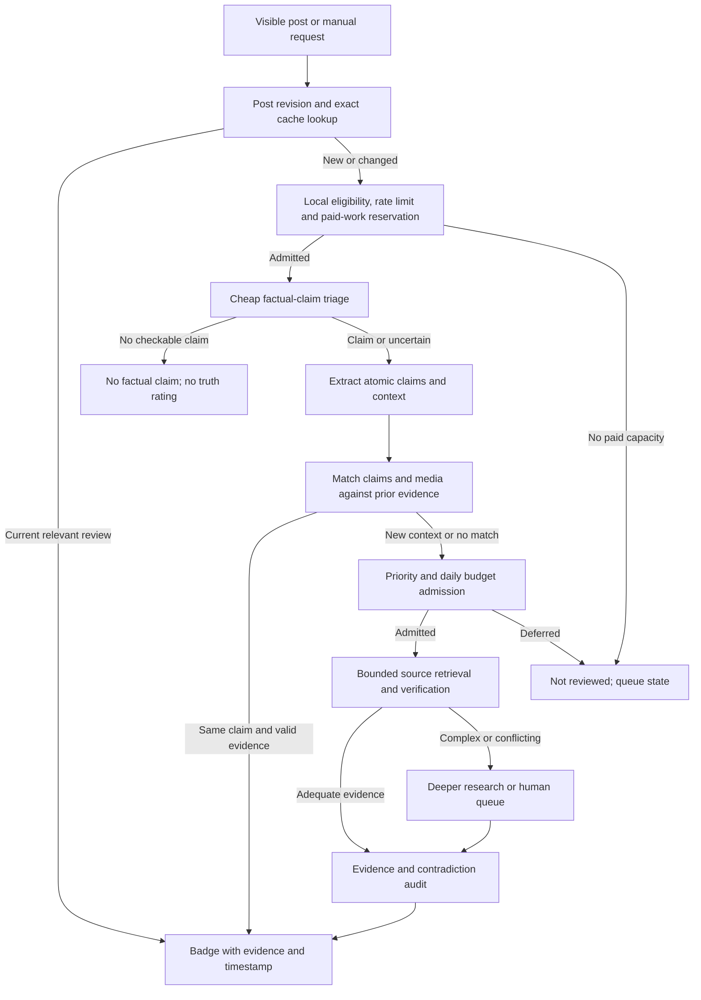

# An automated fact checker for everyday feeds

Design and research snapshot: 19 September 2026. Prices and platform rules must be checked again before launch. Proposed workloads, accuracy gates and latency goals below are design assumptions, not measured results. The Jantar Mantar example is treated as a motivating scenario; no particular protest video or political post has been verified in this task.

## Recommendation

Build a Chrome extension backed by a shared, versioned claim-and-evidence index. Start with a narrow English/Hindi news and public-affairs pilot, with Hinglish and other languages marked unsupported until evaluated. Review the claims that participating users encounter, prioritizing repeated and consequential claims. Reuse supported conclusions only when their factual context still matches.

The initial business constraint is access to posts, followed by the number of new searches. A million unique posts a day is not a $10/day ingestion workload on the published X API. A small, capped research service may fit; broad autonomous coverage and unlimited manual checks do not fit that budget together.

The first release should measure whether the shared evidence index covers enough actual feed impressions. Do not begin by building a platform-wide crawler or by promising 60% coverage.

## Correcting the proposed funnel

Under the suggested proportions, one million posts becomes:

| Branch | Posts/day | What is still unknown |
| --- | ---: | --- |
| Apparently personal/opinion/no checkable claim | 700,000 | Classification errors and factual claims embedded in jokes/opinion |
| Text candidates | 150,000 | Number of distinct claims; retrieval success; research cost |
| Media candidates with an apparent prior match | 105,000 | Whether the caption asserts the same date, place, people and event |
| Unmatched media candidates | 45,000 | Source discovery, transcription, verification and unresolved cases |

The arithmetic is 45,000, approximately the proposed 50,000. These percentages describe a hypothesis, not an observed distribution. “Text-only” does not imply easy, and “repost” does not imply an inheritable verdict. A post can contain several claims, so work per post may exceed one check.

If 70% of the same feed truly contains no checkable claim, at most 30% of its impressions can receive a substantive factual rating. A 60% rating target then requires a different feed composition. Calling opinion posts “checked” would hide that conflict.

Measure three denominators separately:

1. **All-feed verdict coverage:** impressions displaying a completed evidence-backed result divided by all sampled feed impressions. Report exclusions, languages and sampling scope.
2. **Factual-feed coverage:** completed results divided by impressions containing checkable claims. Report unresolved reviews separately from determinate verdicts.
3. **Useful intervention rate:** impressions where a result corrects or materially contextualizes a claim, measured with user feedback and audit.

Also track unique claims researched, exact/context-safe reuse rate, cost per new claim and per 1,000 covered impressions. Count each visible impression once; DOM rerenders must not inflate coverage. An arbitrary visibility threshold can be defined for measurement, but validate it and keep it consistent.

## Acquiring posts without a firehose

On X, published Post-read pricing is $0.005 per resource. A million distinct daily reads would imply $5,000/day, and 30 million/month exceeds the 3 million/month self-serve cap. The paid-read comparison is an illustration, not an enterprise quote. [X pricing](https://docs.x.com/x-api/getting-started/pricing)

Reddit requires approved API access; commercial use needs written approval. The eligible free rate allowance is not a commercial license. Treat any commercial fee as unknown until agreed. See [the platform-access memo](research/platform-access.md) for primary sources and extension/privacy constraints.

Proposed intake, conditional on platform permission:

- The extension observes public posts actually rendered on supported feed pages. It looks up existing results for visible posts first. It does not crawl unseen timelines or collect DMs, cookies or authentication tokens.
- For an uncached post, automatic research eligibility uses the visible X view count above 1M, or a configured Reddit community plus relative engagement/velocity threshold. Missing view counts mean unknown eligibility; do not invent them. There is no need to search every post globally just to determine its popularity.
- Reddit “major” needs a rule: choose a small explicit community list, then rank within each community using post age and available score/comment activity. Scores fluctuate and are not equivalent to X views. Keep violence, public-health and breaking-event claims eligible for a high-impact queue even below normal thresholds.
- Every supported post has a manual Check action regardless of popularity. Below-threshold posts can still display already-cached results cheaply.
- Send the minimum content needed for an opted-in feature. Separate automatic cloud processing permission from optional email consent. Show what goes to the backend, retention, deletion controls and third-party processors.
- Use licensed API/partner ingestion for proactive coverage only when justified by measured demand. Community Notes and fact-check indexes can seed evidence, subject to their terms.

An extension makes intake demand-driven; it does **not** create permission to scrape or redistribute platform data. Access approval is a launch dependency. Until that is resolved, evaluate using licensed fixtures and deliberate user submissions under applicable terms. Do not quietly assume browser collection is the free equivalent of an approved platform API.

Community Notes public snapshots can seed historical checks, but the official download documentation describes a 48-hour data lag plus best-effort daily release. Track current status and underlying evidence; a note's existence alone is not a verdict. [Community Notes downloads](https://communitynotes.x.com/guide/en/under-the-hood/download-data)

Google Fact Check Tools supports text and image lookup over previously fact-checked claims. It does not fact-check arbitrary new content or guarantee comprehensive web matches. The image endpoint needs a publicly accessible image URL; do not publish a private user upload to satisfy it. Quotas, permissions and reuse rights need validation. [Text lookup](https://developers.google.com/fact-check/tools/api/reference/rest/v1alpha1/claims/search), [image lookup](https://developers.google.com/fact-check/tools/api/reference/rest/v1alpha1/claims/imageSearch)

## Review pipeline

**Stage 0 — Exact reuse.** Canonical platform ID plus revision/content hash, language, result expiry, attachment fingerprints and relevant parent/quoted-post dependency revisions. This saves token and search costs before model classification. Different surrounding thread context can invalidate a result even if the visible text is identical; missing required context blocks direct reuse. Before any paid classification, extraction, OCR or matching, apply local eligibility and rate limits and reserve its maximum permitted cost. Research admission later reserves additional work; it is not the first spending gate.

**Stage 1 — Cheap triage.** Rules and a small classifier identify factual assertions, opinion-only text, first-person anecdotes without external evidence, questions, satire and mixed posts. Mixed posts retain their factual claims. Send ambiguous examples onward. Sample rejected posts for audit, otherwise the first filter can silently discard the most important claims. Keep classifier updates separate from verdict policy.

**Stage 2 — Claim extraction and match.** Represent subject, predicate, object, quantity, units, polarity, attribution, geography, asserted event time and reference date. Preserve qualifiers such as “some,” “all,” “doubled,” “today,” and “according to.” A quote claim (“X said Y”) is distinct from Y being true. Resolve screenshots through OCR and source links, then test equivalence; an embedding match only proposes candidates.

**Stage 3 — Cheap evidence resolution.** Search internal reviewed claims and licensed existing checks. Prefer original documents, records and full primary context where applicable; use reputable independent reporting when primary evidence cannot settle the question. Keep evidence origin and publication/event dates. Syndicated articles copying one report are one source chain, not independent corroboration. Never use a search snippet or a model's memory as sufficient evidence for an extreme rating.

**Stage 4 — Bounded new research.** Retrieve sources, extract supporting and contradicting passages, compare dates and scope, and produce a structured proposed conclusion. Search both for support and for potential refutation. Direct evidence may settle a simple claim; lack of a web match does not make a claim false. Stop if the evidence cannot support a result within budget.

**Stage 5 — Deeper review.** Escalate conflicting sources, numerical reasoning, novel video, event chronology, translation ambiguity and high-impact claims. A separate critique checks whether citations actually establish the conclusion and whether important claims were omitted. Multiple calls to the same model are not independent ground truth. Route the hardest consequential cases to a human; at $10/day this is founder labor or explicitly unfunded capacity, not paid moderation hidden in the estimate.

**Stage 6 — Publish and refresh.** Store evidence-backed claim results, their scope, timestamps, uncertainty and version. If one key assertion is false while another is true, show the main finding and a “mixed claims” annotation. Do not average numerical truth scores into a misleading green badge. Unchecked material claims must remain visible as unchecked.

External pages, post text, OCR and source documents are untrusted data. They cannot change the review instructions or invoke tools. Restrict fetching, block private-network URLs, constrain redirects/download sizes, cap tool calls and parse structured outputs. Fabricated citations, missing passages or invalid dates fail validation and produce an unresolved state.

## Reuse, inheritance and original sources

Keep four different entities: **post revision → claim assertions → media assets → evidence/review versions**. Store typed edges such as `asserts`, `contains`, `derived_from`, `supports`, `contradicts` and `supersedes`. PostgreSQL tables are sufficient initially; a separate graph database is unnecessary.

The reusable unit is the claim in context, not an author's trust score or a bare image. A media match supplies reusable evidence about that media. Verdict inheritance additionally requires equivalent assertion, attribution, date, place and framing, valid sources, and no material new contradiction. Never inherit through an unchecked chain of reposts: link each reuse to its canonical reviewed claim and evidence version. Corrections fan out to all dependent badges.

For media, use exact file hashes, perceptual image/frame hashes, OCR, scene/keyframe sampling and optional audio fingerprints/transcripts to retrieve candidates. Verify the match and relevant segment before attaching evidence. Mirroring, cropping, overlays, re-encoding, partial splices and changed audio require distinct tests. Run costly reverse lookup on a few distinctive frames after local matching fails. Browser media access/CORS or protected playback may prevent local hashing; fall back to a permitted server path or mark the media uninspected.

In the old-protest-video scenario, finding the same footage in a credible earlier publication can refute “this footage is from today's protest.” It does not prove the newly alleged event never happened, establish the original camera operator, or identify the exact recording date. Show **earliest verified appearance** unless origin is independently established. Compare upload dates with event dates; a platform timestamp alone dates the upload.

Source records should include URL, publisher, quoted relevant passage or permitted excerpt, fetched time, publication time, event-time claims, media interval/frame IDs and access/retention restrictions. Preserve only what licensing permits. Revalidate edited/deleted sources and volatile claims; suggested TTLs are hours for breaking events, days for changing statistics and longer for stable archival facts. These are configurable policies, not universal validity periods.

Deletion processing must follow source lineage: remove platform-derived text, OCR, media, hashes, author identifiers and dependent cache entries when the governing rules require it. Anonymization is not a substitute for deletion. Keep independently obtained evidence only when its own rights and retention rules allow it, and invalidate reviews whose remaining evidence no longer supports them. See [Reddit's deletion guidance](https://support.reddithelp.com/hc/en-us/articles/16160319875092-Reddit-Data-API-Wiki).

Detailed techniques and limitations: [media integrity memo](research/media-integrity.md).

## AI-generated media and potential harm

Maintain separate fields for **provenance**, **claim truth** and **potential impact**. Synthetic imagery can be clearly labeled satire or illustration. Authentic footage can make a false claim through a misleading caption. Harm prioritization should ask what the post claims to depict and the consequences of misidentification, fabricated evidence or dangerous instructions; it should not treat political disagreement as factual error.

First inspect valid provenance credentials or supported generator watermarks when present. Then try prior-media matching and source/timeline checks. Use an AI detector only as a weak, calibrated signal for prioritizing selected cases, not a universal scan or a verdict generator. Missing credentials do not prove authenticity; valid signed provenance does not prove that the depicted claim is true. Re-encoding and unfamiliar generators make detector behavior uncertain. Strong public “AI-generated” labels need attributable provenance or corroborated forensic evidence. Otherwise use “origin unverified” or “possible manipulation.”

A cheap triage can flag alleged violence, public-figure impersonation, emergencies or dangerous factual instructions for faster review, regardless of whether the media is synthetic. This avoids spending on AI detection when a date/source contradiction already settles the factual issue.

## Ratings and extension experience

Retain the five-level concept, but recommend wording that expresses evidence strength rather than absolute certainty:

| Score | Suggested display | Meaning |
| --- | --- | --- |
| 5 | Strongly supported | Direct, relevant, high-quality evidence; key claims checked |
| 4 | Probably true | Evidence supports it, with material limitations disclosed |
| 3 | Unsure | Reviewed, but evidence is insufficient or conflicting |
| 2 | Likely false | Evidence weighs against it, with residual uncertainty |
| 1 | Refuted | Strong evidence contradicts the stated claim |

The requested “sure true/surely false” wording can map to 5/1, but should not imply infallibility. Thresholds must be calibrated on labeled cases, not taken from a model's self-reported confidence. **Not reviewed, queued, no factual claim, unsupported language and media unavailable are separate states**, never an automatic 3 or 5.

Place a compact labeled badge under the post, with color plus text, a specific explanation (“older footage presented as current”), and a details view containing the claim, sources, date checked and any limitations. Make correction/appeal accessible. Identify results as this extension's assessment, distinct from native Community Notes or platform UI.

Manual request flow:

1. Immediate acknowledgement and canonical request ID. Coalesce concurrent requests for the same claim/revision into one job.
2. Target a current cached result within one second under normal conditions. This is an engineering objective to benchmark.
3. Target a sourced initial answer within 15 seconds for straightforward admitted checks. If research is incomplete, show the actual pending state and available evidence; do not force a verdict to meet the clock.
4. Novel media or contested claims continue asynchronously, potentially for minutes or longer. A queue may be delayed by the daily cap or require human review; show that honestly.
5. If the user opted into email, send one completion email after the result is ready and the originating post is no longer visible. Keep the result in an extension inbox as a reliable fallback if browser visibility information is unavailable. Do not promise exact background tab observation after the browser closes.

Store email subscriptions separately from claim evidence and browsing history. Verify the email address, allow unsubscribe/deletion, use transactional delivery and deduplicate by user/request/review version. No automatic email about every viewed post. The $10 budget requires per-user fair-use limits; clicks cannot authorize unlimited researcher spending. A Check action remains available, but admission, pending and capacity states are distinct from completed research.

## Budget, operating controls and expansion

See the editable [cost assumptions](cost_assumptions.json), [calculator](cost_model.py), and [pricing research](research/unit-economics.md). The proposed pilot has 1,000 cheap triage calls, 300 fresh simple checks, 10 additional deep reviews, 100 reverse-image/frame lookups and 100 paid X reads per day. These are daily capacities, not a claim that 300 distinct posts cover a fixed number of users.

The planned operating subtotal is **$8.54/day**, leaving roughly **$1.46** against a $10 cap before unknown licensing, taxes or excess usage. It includes a $1/day infrastructure allowance; that allowance is not a provider quote or a million-post capacity claim. The source of other candidate posts still needs lawful permission, and any Reddit/partner fee remains unpriced. Human labor and development are excluded. The 10 deep reviews are additional work on a subset of the 300 checks, not 10 extra guaranteed completed claims. An alternative using native Meta search targets 400 quick checks plus 20 escalations at $8.80/day, but needs enforceable query/spend limits before it can support a hard cap.

| Daily allocation | Assumption | Planned cost |
| --- | --- | ---: |
| Triage | 1,000 × 500 input / 200 total output tokens, Gemini 3.1 Flash-Lite | $0.425 |
| Simple checks | 300 × 3,000 input / 1,000 total billed output / 2 Brave searches | $5.40 |
| Additional deep review | 10 × 20,000 input / 5,000 total billed output / 8 Brave searches | $0.8625 |
| Reverse image/frame lookup | 100 billable Web Detection units | $0.35 |
| X API | 100 new billable Post reads | $0.50 |
| Infrastructure and delivery | Hosting, cache, CPU/OCR, storage, bandwidth, logs, email allowance | $1.00 |
| **Operating subtotal** | **Before unknown licenses, taxes and labor** | **$8.5375** |

The default uses Muse Spark 1.3 Standard with application-controlled Brave search for research, with all model calls and reasoning output included in each aggregate token allowance. Contributor is a lower-priced alternative that allows training on requests; check content rights and user disclosures before enabling it. No baseline assumes free credits, cache discounts or a proprietary detector license. Native search charges are per generated search query, not necessarily per tool invocation. Counts are workload assumptions; APIs must be instrumented to measure actual usage. Even 200 total output tokens for triage needs testing: minimal thinking is not necessarily zero thinking. Truncation or exhaustion means incomplete, never a fabricated verdict.

Budget enforcement needs two ledgers: actual provider charges and reservations for jobs in flight. Reserve token/output/tool bounds before launching a job; reconcile actual costs afterward. Treat the daily ceiling as a hard scheduling limit and disable automatic credit refill. Where native search cannot be tightly bounded, use application-controlled search calls or a conservative reserved allowance and vendor caps. The calculator defaults to that controlled-search path; it is more expensive per review and requires fewer daily checks than the native-search alternative. A statistical average alone cannot enforce a strict $10 ceiling.

Allocate a portion of admitted checks to manual requests and audits; the capacities above include them. Suggested starting allocation is 70% automatic priority research, 20% manual reserve, 10% random audits/corrections, adjusted using measurements. Do not let a burst of low-value requests exhaust the entire budget. Add abuse limits, bounded retries and queue expiry. If the cap is reached, serve cached results and label new work deferred.

Prioritize expected **new relevant impressions covered × consequence of an error × probability research will resolve it ÷ expected incremental cost**. Estimate these terms from aggregate pilot behavior; do not infer truth from author popularity, votes or political affiliation. Reserve random sampling to discover topics/languages that the priority rule misses.

Scale through $10, $100 and $1,000 daily research ceilings only after measuring precision, cost, demand and repeat coverage. The calculator includes illustrative allocations for each tier; licenses and human operations scale separately. Additional budget buys new evidence and fresher reviews, while the shared cache can serve repeat impressions cheaply. A growing index is not guaranteed to reduce cost: breaking-news novelty and new language/community cohorts can continually lower reuse.

| Daily ceiling | Fresh checks | Additional deep reviews | Modeled subtotal | Expansion condition |
| --- | ---: | ---: | ---: | --- |
| $10 | 300 | 10 | $8.54 | Authorized intake, bounded workload, offline quality gates |
| $100 | 3,000 | 100 | $78.38 | Observed demand/reuse, viable commercial access, supported language evaluations |
| $1,000 | 30,000 | 1,000 | $768.75 | Contracted acquisition, staffed corrections, measured infrastructure capacity |

These are illustrative allocations using controlled search; the remaining amounts must absorb licensing, contingency and any infrastructure underestimation. Labor and tax remain outside the subtotals. The larger tiers assume proportional increases in triage, media and X-read quotas, not unrestricted platform collection. A review that appears on 100 relevant impressions amortizes its research cost over those impressions; a review never seen again does not. Measure that distribution, not just its average, because a few viral claims can conceal poor everyday coverage.

At larger scale add licensed platform/event discovery, more language evaluation, stronger media retrieval, human review capacity, geographically appropriate storage, and independent monitoring of source changes. Funding options are paid manual-check quotas, organization subscriptions or partnerships; unit economics must cover acquisition and review costs before promising unlimited consumer use. Do not fund verdict placement or change ratings for sponsors.

## Minimal system and evaluation sequence

Initial components: Manifest V3 extension with X/Reddit adapters; a small HTTPS API; PostgreSQL for claims, evidence, revisions and jobs; one bounded worker pool; permitted object storage for limited media samples; and a transactional notification service. Use indexed hashes/full-text search first; add vector retrieval if the matching benchmark shows it helps. Keep API secrets on the server. A million candidate metadata rows/day may be mechanically manageable, but that does not make ingestion rights, media downloads or evidence research affordable.

Suggested entities: `post_revision`, `claim`, `post_claim`, `media_asset`, `media_occurrence`, `evidence`, `review`, `review_dependency`, `job`, `budget_reservation`, and a separately permissioned `notification_subscription`. Every published result records model/prompt/policy versions and citation checks. Store an auditable structured rationale, not private model chain-of-thought.

Useful API shapes: batch lookup for post revisions; submit/check request; poll or subscribe to a job; fetch a versioned review; request a correction; subscribe/unsubscribe to completion. Jobs use durable idempotency keys, survive disconnects and can be cancelled when obsolete.

Build sequence, with no extension implementation in this deliverable:

1. **Access and evidence corpus:** document permitted intake; curate 500–1,000 licensed or permissioned cases across text, screenshot, reused media, numbers, satire and mixed claims. Include English/Hindi, minority viewpoints and changed-context duplicates. Obtain independent labels/adjudication where possible.
2. **Offline pipeline:** measure triage misses, claim matching, citation entailment, wrong inheritance, retrieval success, cost and latency. Split by event/media/claim family and time to avoid training/test leakage. Audit both rejected and accepted candidates. Estimate coverage from real consented feed samples, not a curated misinformation-only set.
3. **Shadow pilot:** serve 50–100 consenting desktop testers as a recruitment target, but keep badges hidden or clearly experimental until quality gates pass. Record impressions and reuse in aggregate with consent. The proposed budget does not guarantee support for that number of users.
4. **Limited visible release:** target high precision for extreme ratings, disclose evidence, support appeals and monitor corrections. Proposed gates: at least 98% observed precision for extreme labels and at least 99% context-correct inheritance on held-out cases, with confidence intervals and per-language breakdown. These are targets, not achieved metrics; small samples cannot substantiate them. Track missed factual claims and indeterminate coverage alongside precision to expose excessive abstention.
5. **Expand based on evidence:** pursue 60% factual-feed coverage within the chosen cohort first. Separately publish all-feed coverage and the cost required. Expand scope only when the accuracy/coverage frontier and access agreement support it.

For a strict initial budget, the next milestone is a permissioned offline evaluation showing how many useful feed impressions one researched claim actually covers. That observation decides whether the product's economics work; increasingly elaborate model orchestration cannot substitute for it.

Rate references for the calculator: [Meta](https://dev.meta.ai/docs/pricing-rate-limits), [Gemini](https://ai.google.dev/gemini-api/docs/pricing), [Brave](https://brave.com/search/api/), and [Vision](https://cloud.google.com/vision/pricing).
